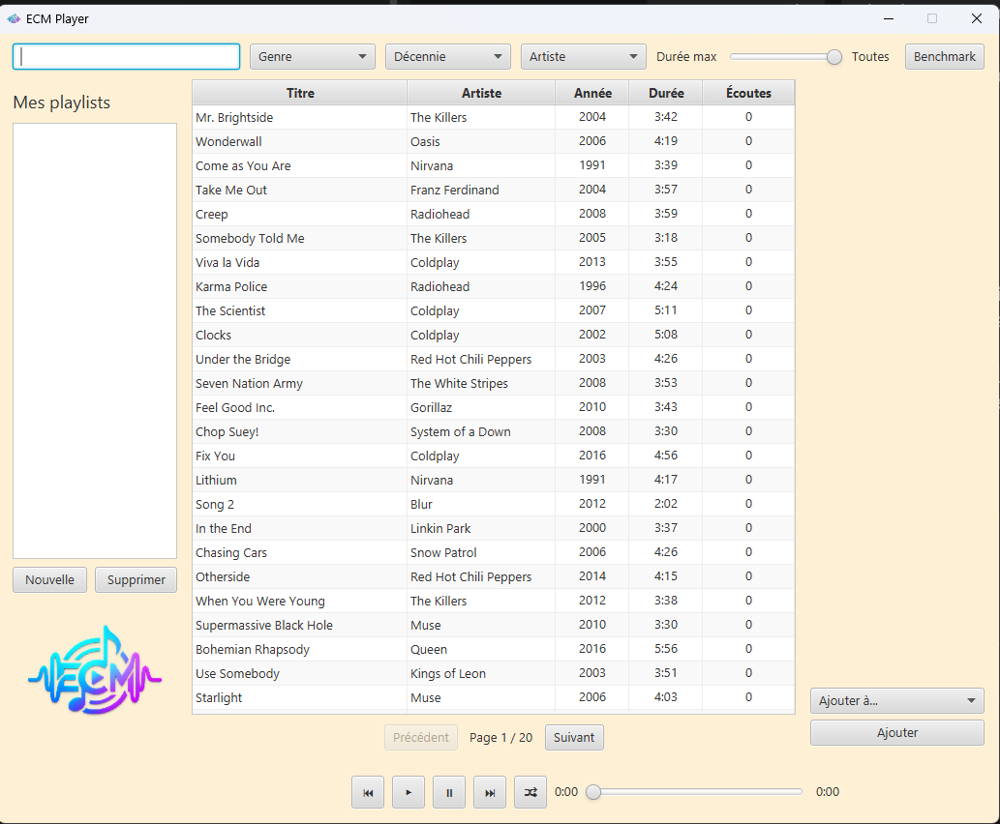
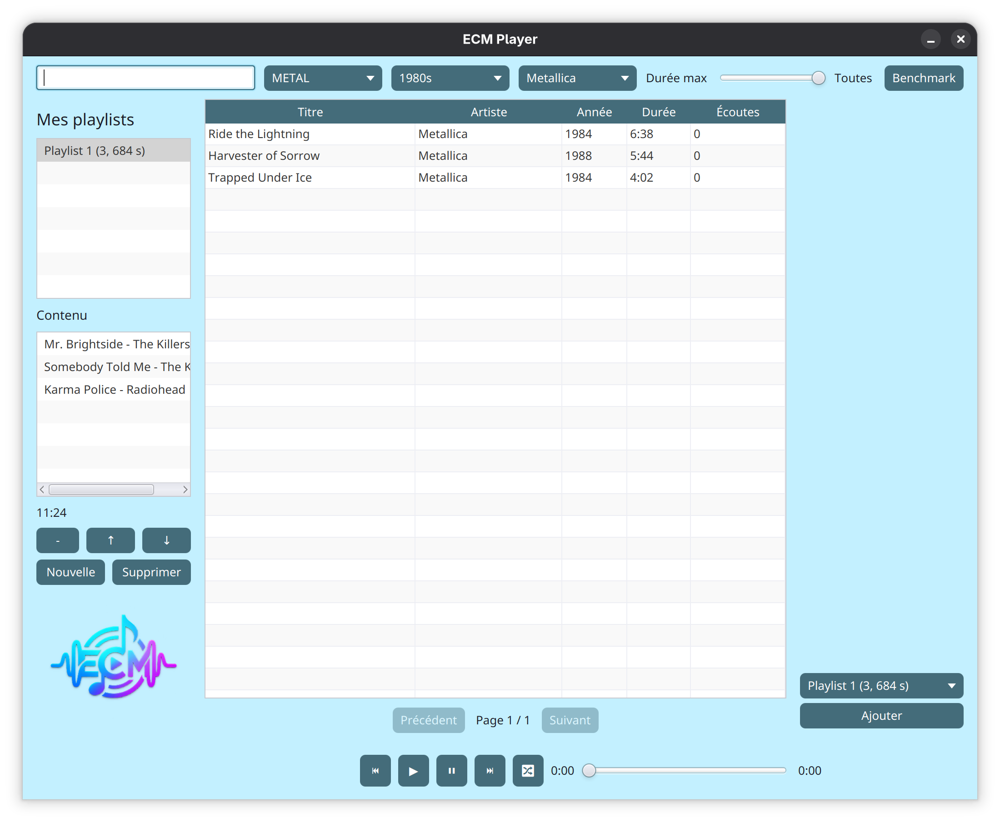
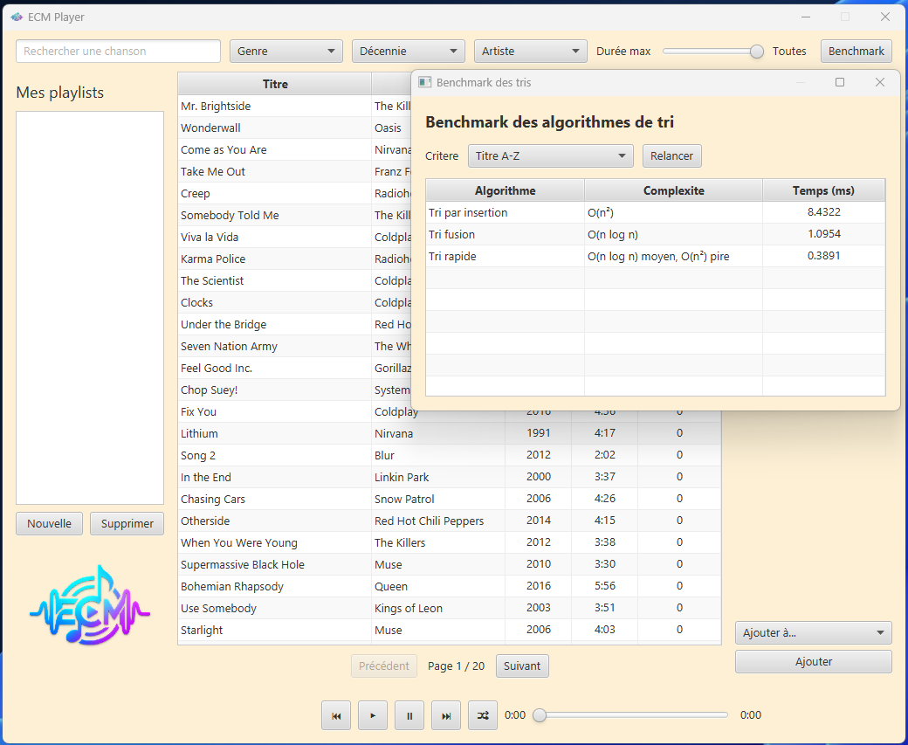

# Lab 2 et 3 : Spotify Playlist Manager

**Cours** : 420-930-MA — Algorithmes et modèles de programmation
**Session** : Été 2026, groupe 25604

**Laboratoire** : 3 (Application JavaFX v1)
**Date de remise** : 20 septembre 2026, 23h59

**Laboratoire** : 2 (Application JavaFX v1)
**Date de remise** : 13 septembre 2026, 23h59

---

## Équipe

| Nom complet | Adresse courriel | Contribution principale                         |
|-------------|------------------|-------------------------------------------------|
| Eva Bessette |  | UI FXML, Controller, CSS, Recherche, Pagination |
| Marc-André Dufour |  | Algorithmes, Benchmark                          |
| Charles Legault |  | Modèle, Service, Filtres,  Tests                |

---

## Sujet choisi

**Numéro du sujet** : 3

**Nom du sujet** : Spotify Playlist Manager

---

## 🔗 Lien du dépôt GitHub PUBLIC

**URL** : https://github.com/bleeband/Lab2_algo

> ⚠️ Vérifier que le dépôt est **PUBLIC** et accessible sans authentification.
> Tester le lien dans un navigateur privé avant la remise.

---

## Fonctionnalités implémentées

### ✅ Obligatoires (cocher ce qui est fait)

- [x] Architecture MVC avec packages séparés (model / service / algorithmes / controller / util)
- [x] Chargement des données depuis fichier CSV (nombre de lignes : 494)
- [x] Interface JavaFX principale avec liste/tableau
- [x] Panneau détail affichant l'élément sélectionné
- [x] Pagination fonctionnelle (taille de page : 25 chansons)
- [x] Filtres multi-critères combinables (nombre implémentés : 4 / 4)
- [x] Recherche par texte en temps réel
- [x] Interface Algorithme définie
- [x] Tri #1 implémenté : Tri par insertion
- [x] Tri #2 implémenté : Tri fusion
- [x] Tri #3 implémenté : Tri rapide
- [X] Comparateur/benchmark des tris avec mesure du temps
- [ ] Wishlist / Favoris (ajout, retrait, pas de doublons)
- [x] CSS appliqué (thème visuel du projet)

### 🎁 Bonus (cocher ce qui est fait)

- [ ] [Bonus 1 : ex. Mode sombre/clair]
- [ ] [Bonus 2 : ex. Statistiques]
- [ ] [Bonus 3 : ...]

### ❌ Non implémenté (assumer honnêtement)


---

## Structure du projet

```
Lab2_algo/
├── pom.xml
├── README.md
├── screenshots/
│   ├── benchmark.png
│   ├── filtres.png
│   └── principal.png
├── src/
│   ├── main/
│   │   ├── java/
│   │   │   ├── module-info.java
│   │   │   └── org/example/spotifylab/
│   │   │       ├── MainFx.java
│   │   │       ├── model/
│   │   │       ├── service/
│   │   │       ├── algorithmes/
│   │   │       ├── controller/
│   │   │       ├── dao/
│   │   │       └── util/
│   │   └── resources/
│   │       └── org/example/spotifylab/
│   │           ├── data/chansons.csv
│   │           ├── fxml/main.fxml
│   │           └── styles/style.css
│   └── test/
│       └── java/org/example/spotifylab/service/
│           ├── ChansonServiceTest.java
│           └── CsvChansonServiceTest.java
```

---

## Instructions pour lancer le projet

### Prérequis

- JDK 21
- Maven 3.8.5
- PostgreSQL
- IntelliJ IDEA

### Étapes

```bash
# 1. Cloner le dépôt
git clone https://github.com/bleeband/Lab2_algo.git
cd Lab2_algo

# 2. Preparer le fichier de configuration PostgreSQL
cp database.properties.example database.properties
# Modifier database.properties avec vos vrais acces PostgreSQL

# 3. Creer et peupler la base depuis le depot
createdb spotify_lab
psql -d spotify_lab -f schema.sql
psql -d spotify_lab -f donnees.sql

# 4. Compiler
mvn clean compile

# 5. Lancer l'application
mvn javafx:run
```

Important: lancer `psql -f donnees.sql` depuis la racine du projet, car le script utilise le CSV versionne dans `src/main/resources/org/example/spotifylab/data/chansons.csv`.

Au lancement, l'application cree aussi les tables manquantes et peuple automatiquement PostgreSQL depuis le CSV si la table `chanson` est vide. Le script SQL reste versionne pour que le correcteur puisse reconstruire la base manuellement au besoin.

Le fichier `database.properties` n'est pas versionne parce qu'il contient les vrais identifiants. Le fichier `database.properties.example` indique seulement les cles a remplir:

```properties
db.url=jdbc:postgresql://localhost:5432/spotify_lab
db.user=votre_utilisateur
db.password=votre_mot_de_passe
```

### Alternative dans IntelliJ

1. Ouvrir le projet dans IntelliJ (File > Open > dossier du projet)
2. Attendre que Maven télécharge les dépendances
3. Ouvrir `MainFx.java`
4. Cliquer sur le bouton Run

---

## Choix techniques

### Version Java utilisée
Java 21 avec JavaFX 21.0.6

### Format des données
CSV, séparateur point-virgule (;), encodage UTF-8, 494 chansons. Le mode PostgreSQL est branche par DAO; le CSV reste disponible comme autre implementation de `SourceDonnees`.

### Algorithmes de tri implémentés
- Tri par insertion : O(n²)
- Tri fusion : O(n log n)
- Tri rapide : O(n log n) en moyenne, O(n²) dans le pire cas

### Bibliothèques externes utilisées
JUnit 5.12.1 pour les tests
Driver PostgreSQL JDBC 42.7.8 pour la connexion a la base

---

## Difficultés rencontrées
Eva : Pas réussi à mettre certains textes en "bold" avec CSS.

---

## Répartition du travail (auto-évaluation)

| Membre | % contribution estimée | Ce sur quoi j'ai travaillé             |
|--------|------------------------|----------------------------------------|
| Eva Bessette | 33,3 %                 | UI FXML, Controller, CSS, recherche, pagination |
| Marc-André Dufour | 33,3 %                 | Algorithmes de tri, Benchmark          |
| Charles Legault | 33,3 %                 | Modèle, services, filtres, tests       |

---

## Notes pour le correcteur


---

## Captures d'écran (fortement recommandé)

### Écran principal


### Filtres


### Recherche


### Benchmark


---

## Historique Git
**TP3**

**Nombre total de commits** : 113
**Date du dernier commit** : 20 septembre 2026
**Numero du dernier commit** : Commit faa2ae8


**TP 2**
**Nombre total de commits** : 87
**Date du premier commit** : 26 août 2026
**Date du dernier commit** : 13 septembre 2026

Voir l'onglet **Insights > Contributors** de GitHub pour voir la contribution de chacun.

---
